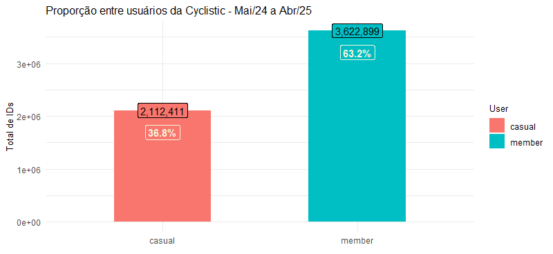

[índice]: https://divvy-tripdata.s3.amazonaws.com/index.html

# Estudo de caso de clientes da Cyclistic (PT-BR)

 Realizado como projeto final do curso de Análise de Dados da Google na Coursera, este estudo tem como objetivo apresentar diferenças entre os tipos de cliente - casuais e membros - de uma **fictícia** empresa de aluguéis de biciletas que atua em Chicago, a fim de moldar um _business plan_ voltado à fidelização dos usuários casuais, uma vez que membros apresentam maior lucratividade e constância na aquisição dos serviços disponíveis. O período observado para estudo compreende 12 meses (Maio de 2024 a Abril de 2025), compreendidos em 12 tabelas `csv.`, sendo cada tabela relativa a um mês.

 Com foco no MKT de fidelização, os executivos e gestores da Cyclistic solicitam do time de análise de dados uma apresentação de _insights_ para guiar as decisões quanto aos clientes, utilizando quaisquer noções e ferramentas capazes de conduzir as etapas _Ask, Prepare, Process, Analyze, Share, Act_. 3 _business tasks_  nortearão o time de MKT e suas medidas futuras; 
 - **1. Como membros e casuais usam as _bikes_ de maneira diferente?**
  2. Por que casuais assinariam a anualidade?
  3. Como a mídia digital pode influenciar na fidelização dos casuais?

- Na proposta do estudo, apenas a pergunta de número 1 foi endereçada a mim, mas decidi analisar o período de forma mais ampla e propor medidas para cada _task_. Cada gráfico será acompanhado de uma análise descritiva (o que aconteceu) e diagnóstica (hipótese de causa); ao fim do estudo, constará a visão prescritiva (como ir adiante).

- Todo o projeto foi conduzido no RStudio, pois construí mais familiaridade com o prgrama na trajetória do curso e julguei ser o software mais veloz no processamento de milhões de linhas, bem como apto a construção de visualizações estáticas mas suficientes para complementar as hipóteses. Fiz uso dos packages **dplyr, ggplot2, janitor e lubridate.**

> ## Integridade dos dados - ROCCC

- [x] Reliable: os dados não têm viés e são próprios para uso no estudo, tendo origem em uma empresa real (Motivate International Inc.).
- [ ] Original: os _sets_ provêm de uma terceirizada (Divvy), então não são exatamente originais.
- [ ] Comprehensive: informações básicas como tipo de membro, data e hora e tipo de bike alugada estão presentes e possibilitam uma compreensão intermediária do caso, mas não são compartilhados dados financeiros (nem mesmo do plano de assinatura), e boa parte das colunas não têm relevâcia alguma na análise, tornando a massa de mais de 5 milhões de entradas desnecessariamente pesada.
- [x] Current: a cada mês são anonimizados e postados no índice [índice] os registros correspondentes.
- [x] Cited: as fontes são seguras, e com recomendação pela Google.

## Database maio/24 a abril/25:

Como as 12 tabelas `csv.` são idênticas no número de colunas e tipos de dados, variando apenas em nº de linhas, foi possível montar a tabela final fazendo o upload dos meses no _environment_ do RStudio para depois coligir os sets em um final com a fórmula `rbind()`. Obtém-se a tabela `Main` de 5.735,310 linhas.

Os usuários, cada qual acredita-se portar um único ID, repetem suas aparições pelos meses, então a verificação de duplicatas de `ride_ID` com `get_dupes()` e "remoção" com `Main <- subset(Main, select = get_dupes(ride_id))` é desnecessário. Não há NAs nas 4 colunas indispensáveis ao projeto: `member_casual, rideable_type, started_at, ended_at`, então a quantia de linhas mantém-se inalterada.

> Com `distinct()`, averiguei que há 3 tipos de veículo - _classic_bike, electric_bike, electric_scooter_ -, sendo impossível dizer se este último é apenas outro nome dado às bicicletas elétricas, já que faltam informações adicionais.

As demais colunas originais foram excluídas, já que identificaçãoes da estação de _docking_ ou longitude e latitude não seriam aplicadas. Para calcular o tempo de viagem usei `difftime()`, e para extrair mês, dia da semana abreviado e hora do dia, usei

O resultado foi um _dataset_ com 10 colunas, 

```


```


